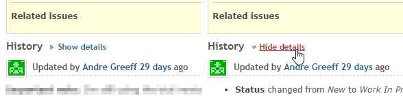
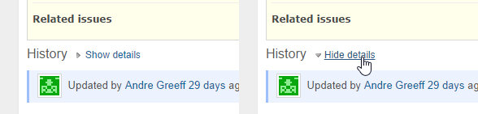
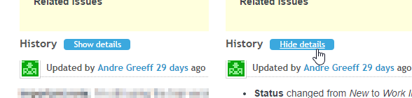

# Redmine Collapsed Journals Plugin

collapses issue history items without an assosiated note.

translated into 4 languages: english, german, russian, ukrainian.

## screenshots

default theme:

Basecamp theme:

Circle theme:

Note: the Circle theme seen above is my modified version, the default does not have any custom styling for this button, however all three screenshots above use the same plugin stylesheet.

## installation notes

must be installed in the `/plugins/collapsed_journals` directory.

other installation instructions are generic and can be found at [Redmine Plugins page](http://www.redmine.org/projects/redmine/wiki/Plugins).

compatible with Redmine 2.2+, tested up to 2.5.2
